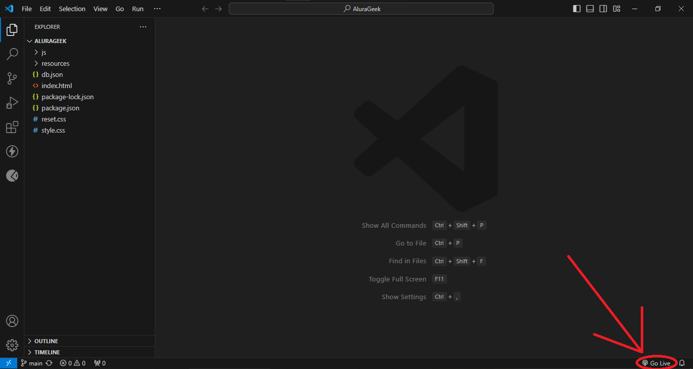

# Challenge Alura Geek

## Realizado con:
- Json-Server
- HTML
- CSS
- JavaScript

## Descripción
Plataforma que permite agregar, listar y eliminar items de una base de datos Json-Server.

## Ejecutar el proyecto
Para ejecutar el proyecto te recomiendo correrlo desde [Visual Studio Code](https://code.visualstudio.com/) e instalar la extensión de [Live Server](https://marketplace.visualstudio.com/items?itemName=ritwickdey.LiveServer) para correr la vista. Para la base de datos debes tener instalado [Node.js](https://nodejs.org/en/download/current), y en la terminal de Visual Studio Code ejecutar los siguientes comandos:
- npm init
- npm install json-server
- npx json-server --watch db.json --port 3001

Para correr la vista en un servidor, como ya habia mensionado es necesario Live Server, cuando ya se ha instalado la extension solo basta con darle en Go Live y listo

